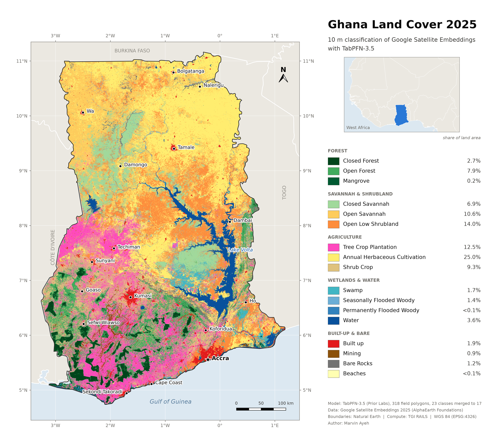
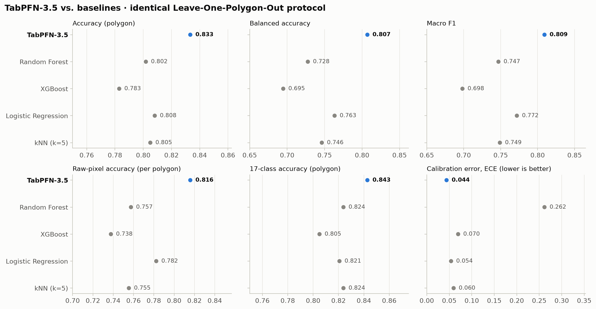
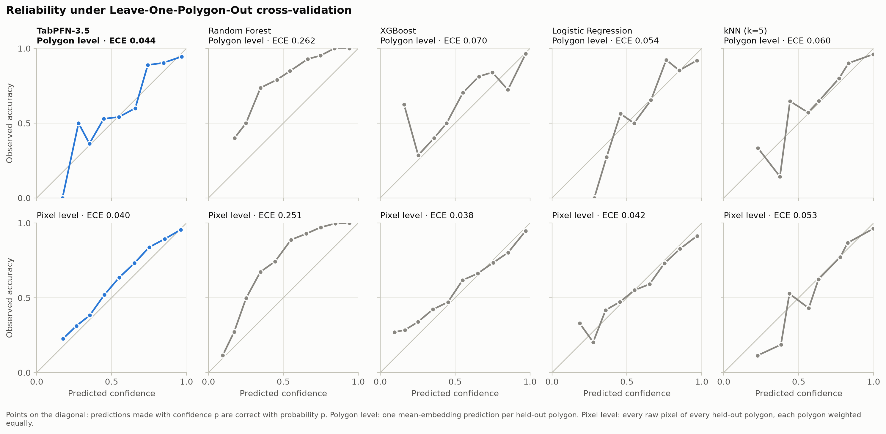
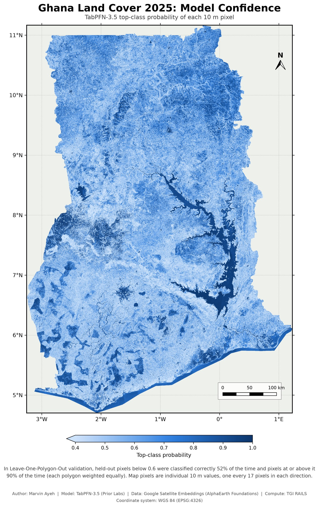
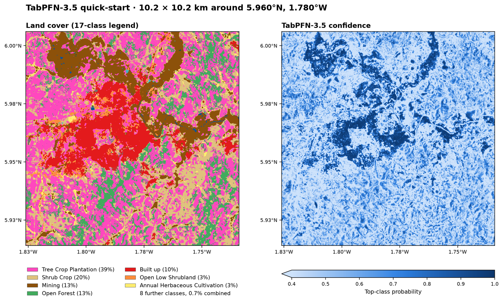

# Ghana Land Cover 2025 - TabPFN-3.5 × Google Satellite Embeddings

**Where does cocoa end and forest begin? A 10 m answer for all of Ghana.**

Ghana is the world's second-largest cocoa producer, and cocoa farming has been one of the leading drivers of forest loss in the country's high forest zone. Under the EU Deforestation Regulation (EUDR), cocoa may only be placed on the EU market if it was not produced on land deforested after 31 December 2020. The same rule covers rubber and oil palm, two other tree crops grown in Ghana.

Meeting that rule means knowing, plot by plot, where tree-crop farms end and natural forest begins. Without affordable national evidence, the burden of proof falls hardest on the smallholder farmers who grow most of Ghana's cocoa.

This project draws that line for the whole country. It is a wall-to-wall, 10 m land-cover map of Ghana for 2025 that separates **tree-crop plantations** (cocoa, cashew, rubber, oil palm, mango) from **closed and open natural forest**. It also maps 14 further classes, from mining scars and wetlands to savannah, cropland and settlements.

- **Tree crops vs. forest:** on held-out field polygons, 94 of 99 tree-crop polygons were classified as tree crops, and only one was mistaken for forest. 23 of 25 forest polygons were recognised as forest.
- **Cocoa:** identified in 47 of 49 polygons, covering 95.5% of their pixels. The published legend groups the tree crops as one class, while the underlying 23-class prediction keeps cocoa separate.
- **Confidence:** every pixel carries a calibrated confidence value, so users can see where the map can be trusted and where a field check is needed.
- **A baseline for change:** the map is a 2025 snapshot. The same pipeline can be applied to the 2020 embeddings, the EUDR cut-off year, to show where tree crops have replaced forest.

The map is built with [TabPFN-3.5](https://huggingface.co/Prior-Labs/tabpfn_3_5) (Prior Labs) for the [TabPFN-3.5 Hackathon](https://platform.priorlabs.ai/hackathon-3.5). TabPFN-3.5 learns the entire classifier in context from 318 field polygons: one 1.6-second fit, with no gradient training and no tuning. It then labels 2.46 billion pixels of Google Satellite Embeddings. Under identical Leave-One-Polygon-Out cross-validation, it outperforms Random Forest, XGBoost, logistic regression and k-nearest neighbours on every accuracy metric.




## Highlights

- **Best of five classifiers under one protocol.** All models are scored by the same Leave-One-Polygon-Out runner. TabPFN-3.5 reaches **83.3% accuracy and 80.7% balanced accuracy**; the best baseline reaches 80.8% and 76.3%. It also has the lowest log loss (0.545 vs. 0.727) and Brier score (0.249 vs. 0.294).
- **Strongest where data is thinnest.** On the 12 classes backed by only 3-9 polygons each, TabPFN-3.5's mean recall is **81.0%**, the same as on the larger classes (80.4%). The baselines reach 64-76%.
- **Calibrated confidence.** On held-out pixels, predictions with confidence ≥ 0.6 are correct **90%** of the time, and those below 0.6 only **52%** of the time. Pixel-level calibration error is 0.040.
- **National scale.** The map covers 238,836 km² of land at 10 m. It comes from 408 embedding tiles (~320 GB) with resumable multi-GPU inference.
- **The training set is a 438 KB CSV.** [`data/polygon_means.csv`](data/polygon_means.csv) holds the model's entire training context, so [`quickstart.py`](quickstart.py) refits TabPFN-3.5 and classifies a 10 × 10 km area in about two minutes on one GPU. It needs neither the 615 MB training file nor the model file, and it reproduces the national prediction exactly for every one of the area's 1,048,576 pixels.

## Why TabPFN-3.5

Field data for land-cover mapping is scarce. Ground-truth polygons are expensive to collect, so national maps rest on a few hundred independent observations. TabPFN is designed for tabular datasets of this size.

- **The polygon is the unit of learning.** Pixels from one polygon are near-duplicates, so each polygon is collapsed to its mean embedding: one row per independent observation, 318 rows in total. TabPFN-3.5 fits this context in about a second.
- **Every polygon is evaluated out of sample.** Each of the 318 folds is a fresh in-context fit on the other 317 polygons. That includes scoring all 440,208 raw pixels of the held-out polygons, and the whole evaluation takes 11.4 minutes on one H100.
- **No segmentation network, no fine-tuning.** The Google Satellite Embeddings already summarise each 10 m pixel's spatial and temporal context in 64 numbers. TabPFN-3.5 turns 318 labelled rows of them into a national classifier, and every pixel is one row of a table.
- **Probabilities you can use.** TabPFN-3.5's top-class probability tracks observed accuracy closely, so it can be published alongside the map as a confidence layer.

## Results

All numbers come from Leave-One-Polygon-Out cross-validation (LOO) over the 318 polygons and 23 field classes. Each polygon is held out once, and the model is fit on the remaining 317 polygon means. The held-out polygon is then scored on its mean embedding and on each of its raw pixels.

### TabPFN-3.5 vs. baselines

The baselines use fixed, standard settings, and TabPFN-3.5 uses its default checkpoint. No model is tuned. Configurations are listed in Section 8 of the training notebook.

| Model | Accuracy | Balanced accuracy | Macro F1 | Raw-pixel accuracy, per polygon | Raw-pixel accuracy, per class | 17-class accuracy | Log loss ↓ | Brier ↓ | ECE, pixel ↓ |
|---|---:|---:|---:|---:|---:|---:|---:|---:|---:|
| **TabPFN-3.5** | **83.3%** | **80.7%** | **0.809** | **81.6%** | **81.5%** | **84.3%** | **0.545** | **0.249** | 0.040 |
| Logistic Regression | 80.8% | 76.3% | 0.772 | 78.2% | 76.3% | 82.1% | 0.727 | 0.294 | 0.042 |
| kNN (k=5) | 80.5% | 74.6% | 0.749 | 75.5% | 68.7% | 82.4% | 2.729 | 0.309 | 0.053 |
| Random Forest (500 trees) | 80.2% | 72.8% | 0.747 | 75.7% | 67.3% | 82.4% | 0.906 | 0.383 | 0.251 |
| XGBoost | 78.3% | 69.5% | 0.698 | 73.8% | 64.6% | 80.5% | 0.863 | 0.338 | **0.038** |



TabPFN-3.5 ranks first on every accuracy metric and on both proper scoring rules (log loss and Brier score). Its pixel-level calibration error is on par with the best baseline's (0.040 vs. 0.038 for XGBoost), and it is clearly better calibrated than Random Forest (0.251). Its advantage is largest on the metrics that weight classes equally, such as balanced accuracy and per-class raw-pixel accuracy: rare classes are where small-data learning matters most.

**Rare classes.** Mean recall on the 12 classes with fewer than 10 polygons, against the 11 larger classes:

| Model | Classes with 3-9 polygons | Classes with ≥ 10 polygons |
|---|---:|---:|
| **TabPFN-3.5** | **81.0%** | **80.4%** |
| kNN (k=5) | 76.3% | 72.8% |
| Logistic Regression | 74.8% | 78.0% |
| Random Forest | 68.8% | 77.0% |
| XGBoost | 64.2% | 75.2% |

**TabPFN-3.5 in detail.**

| Metric | Value |
|---|---:|
| Accuracy, polygon mean | 83.3% |
| Balanced accuracy | 80.7% |
| Macro F1 / precision / recall | 0.809 / 0.817 / 0.807 |
| Top-3 accuracy | 97.5% |
| Raw-pixel accuracy: per pixel / per polygon / per class | 87.2% / 81.6% / 81.5% |
| 17-class legend: accuracy / balanced accuracy | 84.3% / 80.3% |
| 17-class legend: raw-pixel accuracy, per pixel / per polygon | 87.8% / 82.7% |

The per-pixel figure (87.2%) weights every held-out pixel equally. Large, homogeneous polygons therefore dominate it, and Water alone is 33.6% of held-out pixels. The per-polygon and per-class figures give every polygon or class equal weight. Per-class results with Wilson 95% confidence intervals are in `outputs_tabpfn35_polygon/polygon_class_summary.csv`.

- **Strongest classes:** cocoa (47 of 49 polygons), oil palm (12/12), rubber (7/7), mangrove (45/49), built-up (14/15) and cashew (18/20).
- **Weakest classes:** rice (3/9), open low shrubland (6/14), shrub crop (8/15) and closed forest (5/8). Most of their errors fall on spectrally similar neighbours: other annual crops, shrubland and open forest.

### Calibration



A reliability diagram bins predictions by confidence and compares each bin's mean confidence with its observed accuracy. A well-calibrated model lies on the diagonal. TabPFN-3.5's held-out pixels (bottom-left panel, each polygon weighted equally) follow it closely:

| Confidence | Share of held-out pixels | Correct |
|---|---:|---:|
| ≥ 0.6 | 77.8% | 90.1% |
| < 0.6 | 22.2% | 51.7% |
| 0.9-1.0 (mean 0.962) | 42.5% | 95.6% |

Random Forest, by contrast, is strongly under-confident: 64% of its held-out pixels fall below 0.6, yet those are correct 64% of the time.

## The map

The final product, `landcover_tabpfn35_final.tif`, is a 10 m GeoTIFF of about 72,000 × 50,000 pixels with an embedded color table. It is post-processed with a 3×3 majority filter and reclassified from 23 field classes into the 17-class legend.

Mapped area, measured on the full-resolution map inside the Ghana outline:

| Group | Class | Merged from (field classes) | Area (km²) | Share of land |
|---|---|---|---:|---:|
| Forest | Closed Forest | Closed Forest | 6,392 | 2.7% |
| | Open Forest | Open forest | 18,880 | 7.9% |
| | Mangrove | Mangrove | 504 | 0.2% |
| Savannah & shrubland | Closed Savannah | Woodland Savanna | 16,578 | 6.9% |
| | Open Savannah | Open Savannah | 25,283 | 10.6% |
| | Open Low Shrubland | Open Low shrubland | 33,495 | 14.0% |
| Agriculture | Tree Crop Plantation | Cocoa, Cashew, Rubber, Palm, Mango | 29,798 | 12.5% |
| | Annual Herbaceous Cultivation | Rice, ANN | 59,591 | 25.0% |
| | Shrub Crop | Shrub crop | 22,263 | 9.3% |
| Wetlands & water | Swamp | Wetland | 4,086 | 1.7% |
| | Seasonally Flooded Woody | S_Flood | 3,431 | 1.4% |
| | Permanently Flooded Woody | P_Flood | 155 | 0.07% |
| | Water | Water | 8,706 | 3.6% |
| Built-up & bare | Built up | Built up | 4,536 | 1.9% |
| | Mining | Mining, Salt | 2,128 | 0.9% |
| | Bare Rocks | Bare Rocks | 2,891 | 1.2% |
| | Beaches | Beach | 121 | 0.05% |
| | **Total** | | **238,836** | |

These areas are pixel counts of the classified map, not design-based area estimates; see [Limitations](#limitations).

### Confidence map



- **Highest confidence:** water bodies, forest reserves and large urban areas.
- **Lowest confidence:** mosaic landscapes where crops, fallow, shrubland and savannah interleave.

Across the national map, mean confidence is 0.58 and 56% of pixels fall below 0.6. That figure comes from the 8.5 million pixels displayed on the confidence map. On held-out pixels of the field polygons, by contrast, only 22% fall below 0.6. The training polygons are clean, single-class examples, while the wall-to-wall map also contains mixed pixels, transitions and land covers that 318 polygons cannot fully represent.

The LOO accuracies above therefore describe pixels like those in the training polygons. The confidence layer shows where the map departs from them, and those are the places where additional field polygons would improve it most.

## Quick-start

The quick-start classifies a 1024 × 1024 px area (about 10 × 10 km) around Dunkwa-on-Offin: the town, mining along the Offin River, and the surrounding cocoa and tree-crop farms. It takes about two minutes on one GPU. You need a Prior Labs API token and one 417 MB file; no training data, model file or embedding tiles are required.

```bash
pip install -r requirements.txt
cp .env.example .env            # then set TABPFN_TOKEN=<your key> (https://ux.priorlabs.ai/account)

# Download demo/demo_aoi_dunkwa.tif from the Google Drive folder (see Data) into demo/
python quickstart.py --aoi demo/demo_aoi_dunkwa.tif
```



The script refits TabPFN-3.5 on `data/polygon_means.csv`, with the national model's configuration and seed, and classifies every pixel. It writes four files to `quickstart_output/`:
- class codes as a GeoTIFF
- the 17-class map as a GeoTIFF
- confidence as a GeoTIFF
- a side-by-side preview PNG

On this area the quick-start reproduces the national prediction exactly: all 1,048,576 pixels receive the same class and the same confidence value as in `predicted_classcode.tif` and `predicted_confidence.tif`.

Options:
- **Another area:** `--images-dir DIR --center LON LAT --size N` cuts an area from embedding tiles in `DIR`. Only the tiles covering the area are needed; the demo area, for example, lies in `AEF_GHANA_2025-0000055296-0000015360.tif` and `AEF_GHANA_2025-0000058368-0000015360.tif`.
- **Save the cut area:** `--save-aoi FILE` stores the cut embedding stack losslessly, for re-use with `--aoi FILE`.
- **Compare:** `--compare-with predictions_tabpfn35_polygon/predicted_classcode.tif` reports per-pixel agreement with the national prediction.
- **CPU:** use a smaller area, e.g. `--size 256`.

## Reproducing the full pipeline

```bash
pip install -r requirements.txt        # Python 3.11; a CUDA build of torch is strongly recommended
cp .env.example .env                   # set TABPFN_TOKEN
```

Place `Training_Samples.csv` in the repository root and the 408 tiles in `Images/` (see [Data](#data)).

1. **Training and evaluation:** run `Training_TabPFN35_PolygonLevel.ipynb` top to bottom.
   - Time: about 30 minutes. TabPFN-3.5 LOO takes 11.4 min on one H100, and the four baselines about 18 min on CPU.
   - It writes `data/polygon_means.csv` and, in `outputs_tabpfn35_polygon/`:
     - the LOO predictions
     - `polygon_metrics_summary.json`
     - `model_comparison.csv` / `.png`
     - `reliability_diagram.png`
     - `calibration_summary.json`
     - per-class summaries
     - the deployable model `tabpfn35_polygon_model.joblib`
2. **National inference and maps:** run `Predict_TabPFN35_PolygonLevel.ipynb` top to bottom.
   - Time: classifying all 408 tiles takes about 20 hours on 4× NVIDIA H100.
   - It is resumable: completed tiles and finished stages are skipped on re-run.
   - It writes to `predictions_tabpfn35_polygon/`:
     - `predicted_classcode.tif`, `predicted_confidence.tif`: the class and confidence mosaics. Both are checked bit for bit against every tile before the temporary per-tile files are removed.
     - `predicted_classcode_majority3x3.tif`: after the 3×3 majority filter
     - `landcover_tabpfn35_final.tif`: the 17-class map
     - `final_class_land_area.csv`: area per class
     - `landcover_tabpfn35_cartographic_map.png`: the land-cover map
     - `confidence_map.png`: the confidence map

## Pipeline

```
Training_Samples.csv ──▶ Training_TabPFN35_PolygonLevel.ipynb
                          │  pixels → 318 polygon means (data/polygon_means.csv)
                          │  Leave-One-Polygon-Out: TabPFN-3.5 + 4 baselines, raw-pixel scoring
                          │  calibration (reliability diagrams, ECE)
                          │  final TabPFN-3.5 fit on all 318 polygons
                          ▼
Images/*.tif ──────────▶ Predict_TabPFN35_PolygonLevel.ipynb  (+ predict_tile_worker.py)
                          │  multi-GPU inference → class + confidence mosaics (lossless, verified)
                          │  3×3 majority filter → 17-class legend (new_class.xlsx)
                          ▼
             landcover_tabpfn35_final.tif · cartographic map · confidence map · area by class
```

## Repository structure

| Path | Description |
|---|---|
| `Training_TabPFN35_PolygonLevel.ipynb` | Polygon collapse, LOO evaluation of TabPFN-3.5 and baselines, calibration, final model export. |
| `Predict_TabPFN35_PolygonLevel.ipynb` | National inference, mosaicking, majority filter, reclassification, land area, cartographic and confidence maps. |
| `predict_tile_worker.py` | Per-GPU inference worker launched by the prediction notebook. |
| `quickstart.py` | Classifies a small area in minutes from `data/polygon_means.csv`. |
| `lc_eval.py` | Shared Leave-One-Polygon-Out runner, metrics, calibration, evaluation figures, raster utilities. |
| `lc_maps.py` | Cartography: basemap, mode-resampled preview, land area by class, map layouts. |
| `data/polygon_means.csv` | The 318 polygon-mean embeddings with class, pixel count and centroid: the complete training context. |
| `data/natural_earth_west_africa.geojson` | Natural Earth 1:10m country boundaries for West Africa (public domain). |
| `new_class.xlsx` | Mapping from the 23 field classes to the 17-class legend. |
| `color_code.txt` | Legend color table (`code R G B A name`). |
| `docs/` | Figures shown in this README (copies of notebook and quick-start outputs). |
| `demo/demo_aoi_dunkwa.tif` | Quick-start input: 64-band embeddings of a 10 × 10 km area (download from Google Drive). |
| `Training_Samples.csv`, `Images/` | Input data, downloaded separately (see Data). |
| `requirements.txt`, `.env.example`, `LICENSE` | Environment, API-token template, Apache 2.0 license. |

## Data

> 📦 The input data (`Images/` embedding tiles, ~320 GB, and `Training_Samples.csv`, ~615 MB), the quick-start area (`demo/demo_aoi_dunkwa.tif`, 417 MB) and the full-resolution outputs are in this public Google Drive folder: [Google Drive folder](https://drive.google.com/drive/folders/1oWkuMQz3cXYv_grwohInPzaSEHyqtjLC?usp=sharing)

- **Field polygons:** the 318 single-class polygons were digitized by the author in Google Earth Pro.
  - The embedding values of every pixel inside them were extracted in Google Earth Engine.
  - Some classes occur only in particular regions; mangroves and salt pans, for example, are coastal. Their polygons are therefore geographically concentrated.
- **`Training_Samples.csv`:** 440,208 pixels from those polygons.
  - Columns: `system:index` (Earth Engine id; the polygon id followed by a pixel counter), `A00`-`A63` (embedding), `Name`, `code`, `.geo` (pixel location).
- **`Images/`:** 408 64-band GeoTIFF tiles (3072×3072 px, EPSG:4326).
  - Exported from the Earth Engine dataset [`GOOGLE/SATELLITE_EMBEDDING/V1/ANNUAL`](https://developers.google.com/earth-engine/datasets/catalog/GOOGLE_SATELLITE_EMBEDDING_V1_ANNUAL) (AlphaEarth Foundations), year 2025, clipped to Ghana.
- **Boundaries:** [Natural Earth](https://www.naturalearthdata.com/) 1:10m Admin-0 countries (public domain), bundled in `data/`.

## Methodological notes

- **Polygon-held-out evaluation.** Pixels of one polygon never appear on both sides of a split, because the polygon is the unit that is held out.
- **Three ways to average raw-pixel accuracy.** Per pixel, per polygon and per class, as described under Results. The per-polygon and per-class figures are the more representative ones for the map.
- **Identical protocol for all models.** One LOO runner (`lc_eval.run_loo`) produces every number in the comparison: same folds, same training rows, same raw-pixel scoring.
- **Small classes are reported with intervals.** Twelve of the 23 classes have fewer than 10 polygons. Their per-class accuracies carry Wilson 95% confidence intervals, which are wide for classes with 3-5 polygons.
- **Map display.** The cartographic map is read at display resolution with mode resampling, so each map pixel shows the most common class of the 10 m pixels it covers. The confidence map uses nearest sampling and shows individual pixel values.
- **Land area.** Areas are measured inside the Natural Earth outline of Ghana, with per-row pixel areas on a spherical Earth.
  - The final GeoTIFF extends slightly beyond the coastline, where sea pixels are classified as Water. Those pixels are excluded from the land areas but remain in `final_class_pixel_counts.csv`.

## Limitations

- **LOO accuracy describes pixels like the training polygons.** The map-wide confidence shows that large parts of the landscape are less certain. A design-based accuracy assessment, with an independent stratified random sample and area-adjusted estimates, would quantify the map's accuracy and class areas directly.
- **Rare and similar classes.** Rare classes (3-9 polygons) and spectrally similar classes (shrub crop, open low shrubland, rice) are the least reliable. More field polygons for them are the most direct improvement.
- **Single year.** The map is a single-year snapshot (2025 embeddings).

## Credits & acknowledgements

- **[TabPFN](https://github.com/PriorLabs/TabPFN)** by Prior Labs, the tabular foundation model behind all classification in this project ([TabPFN-3.5 model card](https://huggingface.co/Prior-Labs/tabpfn_3_5)). Hollmann, N., Müller, S., Purucker, L. *et al.* "Accurate predictions on small data with a tabular foundation model." *Nature* 637, 319-326 (2025).
- **[TGI RAILS](https://docs.ncsa.illinois.edu/systems/tgirails/).** This research used the TGI RAILS advanced compute and data resource, which is supported by the National Science Foundation (award OAC-2232860) and the Taylor Geospatial Institute. All GPU compute (NVIDIA H100) for model evaluation and national-scale inference ran on TGI RAILS.
- **[Google Satellite Embeddings](https://developers.google.com/earth-engine/datasets/catalog/GOOGLE_SATELLITE_EMBEDDING_V1_ANNUAL)** (AlphaEarth Foundations, Google DeepMind / Google Earth Engine), the 64-dimensional annual embedding dataset used as model input.
- **[Natural Earth](https://www.naturalearthdata.com/)**, public-domain country boundaries for the cartographic map.

## Author

Marvin Ayeh

## License

Apache License 2.0 - see [LICENSE](LICENSE).
